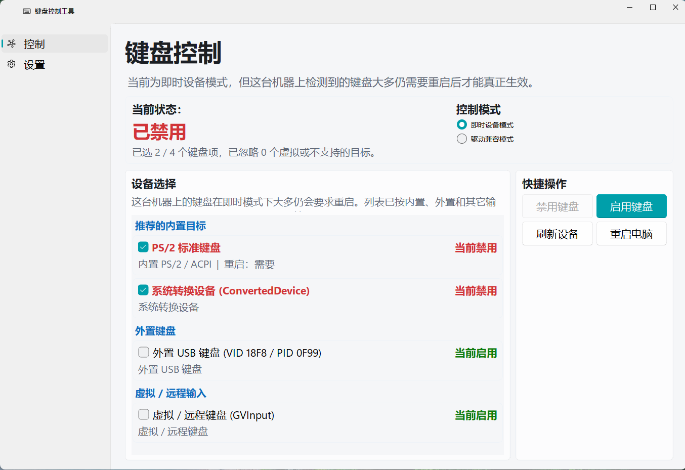

# LockLaptopKeyboard

一个用于在 Windows 上快速禁用/启用键盘设备的小工具，界面采用 Fluent 风格，支持托盘常驻。



## 核心功能

- 一键禁用/启用键盘（支持内置与外接设备）
- 两种控制模式：
  - 即时设备模式（优先，无需重启）
  - 驱动兼容模式（通过 `i8042prt`，通常需要重启）
- 设备列表可选择目标，并显示状态（禁用项红色标注）
- 系统托盘菜单：显示窗口、启用/禁用、重启、退出
- 开机自启、开机最小化到托盘
- 主题支持：浅色 / 深色 / 跟随系统

## 快速开始

```bash
uv run python main.py
```

或直接运行打包后的 `LockLaptopKeyboard.exe`。

## 打包

```bash
uv run pyinstaller LockLaptopKeyboard.spec
```

产物位置：`dist/LockLaptopKeyboard.exe`

## 下载

- 最新发布页：https://github.com/xx025/LockLaptopKeyboard/releases
- v2 直链：https://github.com/xx025/LockLaptopKeyboard/releases/download/2/LockLaptopKeyboard.exe
