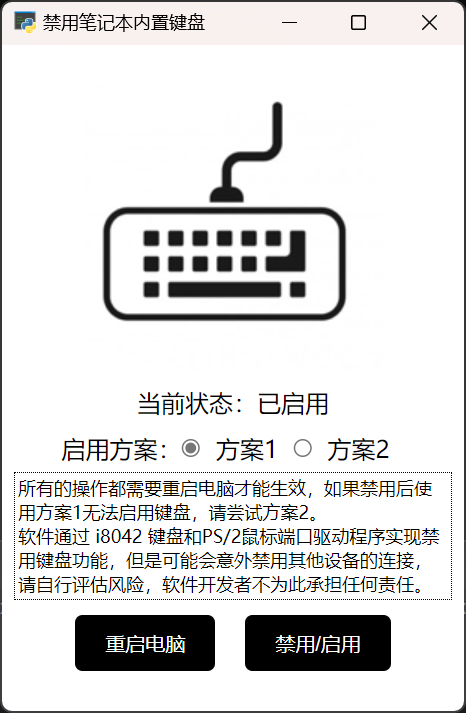

# LockLaptopKeyboard


禁用笔记本内置键盘

程序通过禁用i8042 键盘和 PS/2 鼠标端口驱动程序实现禁用笔记本内置键盘，


### 适用性


>Linux用户可以查看和使用 [toggle_keyboard.sh](toggle_keyboard.sh)

你可以手动以管理员身份运行下面的cmd命令，检查是否适用于你的机器

**禁用**
```shell
sc config i8042prt start= disabled
```

**启用**
```shell
sc config i8042prt start= demand
```
或者
```shell
sc config i8042prt start= auto
```

### 下载软件

[下载软件](https://github.com/xx025/LockLaptopKeyboard/releases/download/1/LockLaptopKeyboard.exe)





### 支持作者

[打赏作者](https://gist.github.com/xx025/63f9621e77d603c7ca7935e72a58f929)

